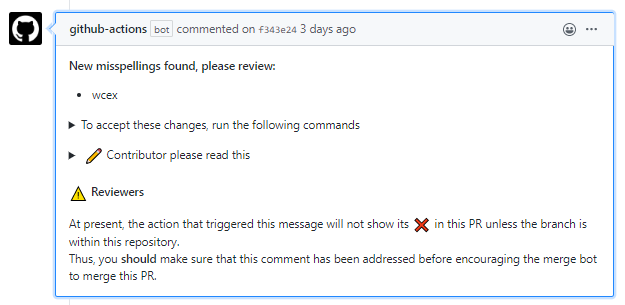
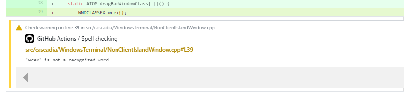
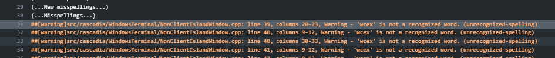

# @check-spelling/check-spelling GitHub Action

## Overview

Everyone makes typos. This includes people writing documentation and comments,
but it also includes programmers naming variables, functions, APIs, classes,
and filenames.

Often, programmers will use `InitialCapitalization`, `camelCase`,
`ALL_CAPS`, or `IDLCase` when naming their things. When they do this, it makes
it much harder for naive spelling tools to recognize misspellings, and as such,
with a really high false-positive rate, people don't tend to enable spellchecking
at all.

This repository's tools are capable of tolerating all of those variations.
Specifically, [w](https://github.com/jsoref/spelling/blob/master/w) understands
enough about how programmers name things that it can split the above conventions
into word-like things for checking against a dictionary.

## Spell Checker GitHub Actions

* [Basic Configuration](#basic-configuration)
* [**Documentation**](https://github.com/check-spelling/check-spelling/wiki/) and [Possible features](https://github.com/check-spelling/check-spelling/wiki/Possible-features)
are listed on the [Wiki](https://github.com/check-spelling/check-spelling/wiki/)
  * [Warning descriptions](https://github.com/check-spelling/check-spelling/wiki/Warnings)
* [Configuration](https://github.com/check-spelling/check-spelling/wiki/Configuration)
  * [Workflow variables](https://github.com/check-spelling/check-spelling/wiki/Configuration#workflow-variables)
  * [Workflows](https://github.com/check-spelling/check-spelling/wiki/Configuration:-Workflows)
  * [Files](https://github.com/check-spelling/check-spelling/wiki/Configuration#Files)
* [Historical information](https://github.com/jsoref/spelling#overview)

### Sample output

#### Comment as seen in a PR

#### Comment as seen in a commit

#### GitHub Action Run log

### Basic Configuration

Just copy the [spell-check-this](https://github.com/check-spelling/spell-check-this)
[.github](https://github.com/check-spelling/spell-check-this/tree/main/.github)
directory into your project.

## Running locally

Yes you can!

### Running locally with Act

1. [Install Act](https://github.com/nektos/act#installation)
1. `act`

:warning: This may break at times as **act** may be missing support for newer GitHub Actions features.

## Prerelease

I do test development on a [prerelease](https://github.com/check-spelling/check-spelling/tree/prerelease) branch.

Features and the behavior of this branch are not guaranteed to be stable
as they're under semi-active development.

## License

[MIT](LICENSE.txt)
